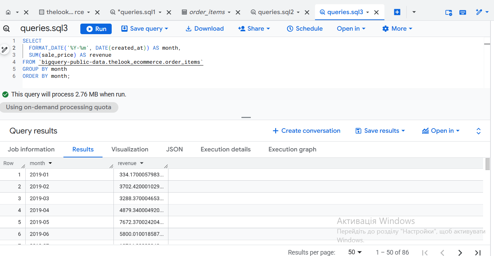

# bigquery-sales-analysis
# BigQuery Sales Analysis

## Project Overview
This project analyzes e-commerce sales data using Google BigQuery and SQL.
The goal was to answer key business questions related to revenue and product performance.

## Tools Used
- Google BigQuery
- SQL
- Public dataset: thelook_ecommerce

## Business Questions & Results

### 1. Total Revenue
This query calculates the total revenue generated from all orders.


---

### 2. Top 5 Products by Revenue
This query identifies the top 5 products that generated the highest revenue.


---

### 3. Monthly Revenue Trend
This query shows how revenue changes over time on a monthly basis.



---

## Project Structure
```bigquery-sales-analysis/
├── README.md
├── queries.sql
└── screenshots/
    ├── total_revenue.png
    ├── top_5_products.png
    └── monthly_revenue.png```


## Key Skills Demonstrated
- SQL aggregation (SUM, GROUP BY)
- JOIN operations
- Date formatting
- Business-oriented data analysis
